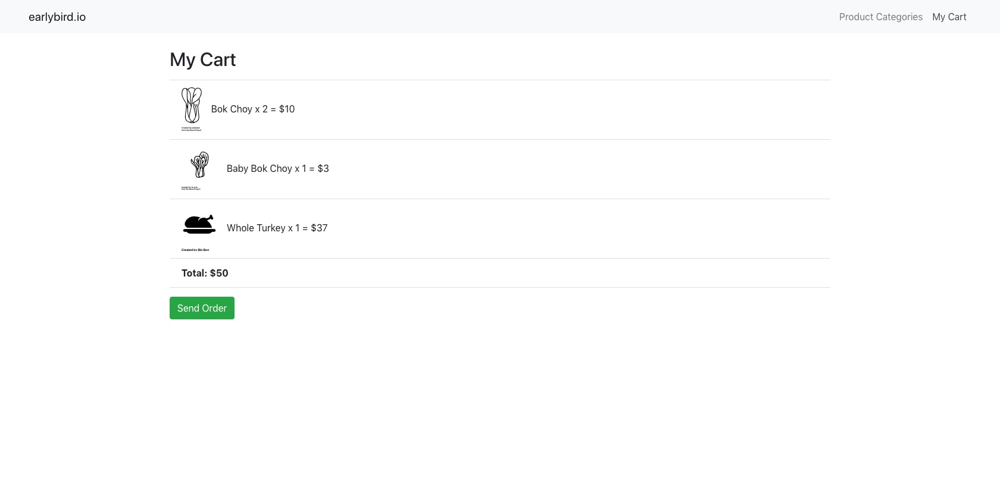

# earlybird.io

earlybird.io is an ecommerce platform for farmers markets built with a React-Redux front-end and connected to a Rails API backend. Have you ever gone to a farmer’s market only to find that every vendor is sold out of eggs, organic bacon, or fresh whole chickens? earlybird.io is a solution to ensuring that Localvores, like you, always get the fresh food you’re looking, without needing to be first in line at the market. Also, by shopping with earlybird.io farmers know how much product to bring to market and are able to sell more product.

* Built front-end UI using React and Redux middleware to respond to and modify state change

* Collected and persisted data to Rails API

* Utilized React-Router to provide dynamic routing within a Single Page App

* Made use of async actions within Redux-thunk and fetch()




## Installation

Fork and clone repo

```
cd early-bird
bundle install
rails db:migrate
rails db:seed
```
Then `rake start` to start Rails and React servers

## Contributions

Bug reports and pull requests are welcome at https://github.com/lauradarlak/early-bird

## Licence

This project has been licensed under the MIT open source license.
